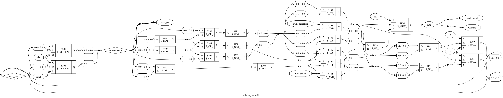
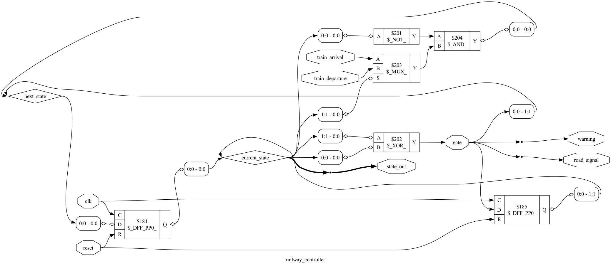

# 🚆 Railway Level Crossing Controller

An **Automatic Railway Level Crossing Controller** implemented in **Verilog HDL** using a **Finite State Machine (FSM)**. The controller automatically controls the railway gate, warning signal, and road signal based on train arrival and departure events.

---

## 📌 Features

- FSM-based controller
- Automatic gate opening and closing
- Warning signal generation
- Road traffic signal control
- Synchronous digital design
- Active reset support
- Functional simulation
- RTL visualization
- Logic synthesis using Yosys

---

## 🛠️ Tools Used

- Verilog HDL
- Icarus Verilog
- GTKWave
- Yosys

---

## 📂 Repository Structure


Railway-Level-Crossing-Controller/
│
├── src/
│   └── railway_controller.v
│
├── tb/
│   └── tb_railway_controller.v
│
├── netlist/
│   └── railway_controller_netlist.v
│
├── scripts/
│   ├── synth.ys
│   └── techmap.ys
│
├── rtl/
│   └── rtl.png
│
├── techmap/
│   └── techmap.png
│
├── waveforms/
│   └── railway.vcd
│
└── README.md


---

## 📥 Inputs

| Signal | Description |
|---------|-------------|
| clk | System clock |
| reset | Active reset |
| train_arrival | Indicates an approaching train |
| train_departure | Indicates the train has left the crossing |

---

## 📤 Outputs

| Signal | Description |
|---------|-------------|
| gate | Opens or closes the railway gate |
| warning | Warning indicator |
| road_signal | Controls road traffic |
| state_out | Current FSM state |

---

## ▶️ Simulation

Compile

```bash
iverilog -o railway src/railway_controller.v tb/tb_railway_controller.v
```

Run

```bash
vvp railway
```

View Waveform

```bash
gtkwave waveforms/railway.vcd
```

---

## 🔧 Synthesis

```bash
yosys scripts/synth.ys
```

---

## 📷 RTL Schematic

*(Add `rtl.png` inside the `rtl` folder and it will appear below.)*

```markdown

```

---

## 🔌 Technology Mapping

*(Add `techmap.png` inside the `techmap` folder.)*

```markdown

```

---

## 👨‍💻 Author

**Ashwin Ashok**

B.Tech Electronics and Communication Engineering

SRM Institute of Science and Technology
